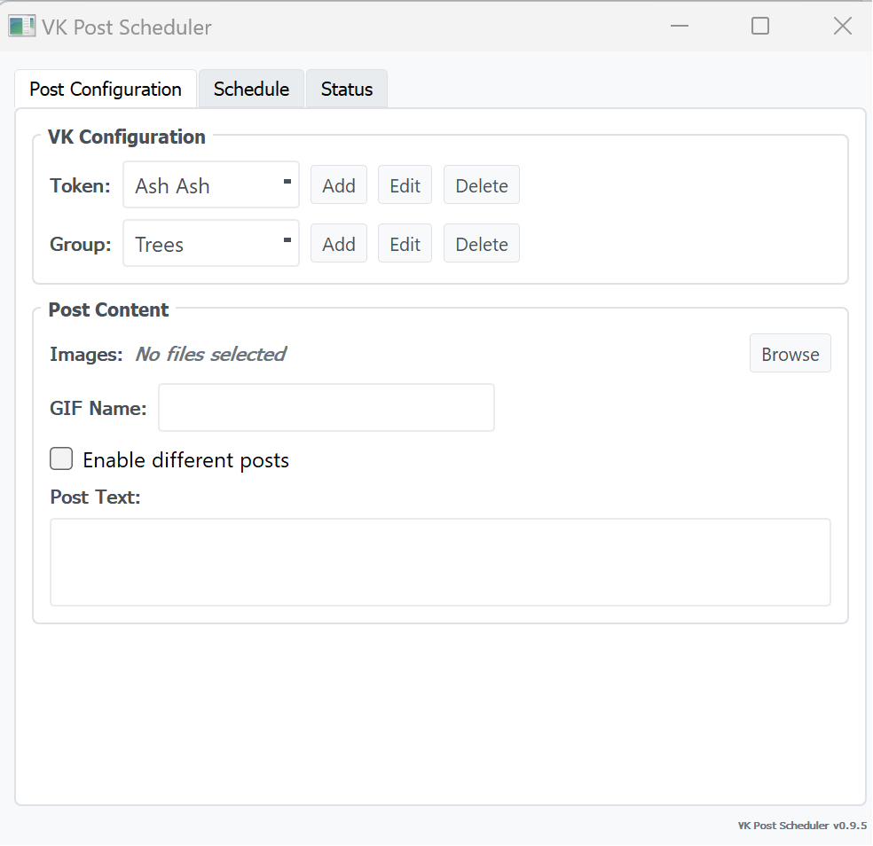

# VK Post Scheduler

This is for those who run VK communities and got tired of scheduling posts one by one in the
web interface, where VK only lets you set a publish date on a single post at a time.
This app takes a text, a set of images and a date range with posting times, and
queues all the delayed posts at once through the API (`wall.post` with
`publish_date`). After that VK handles the publishing automatically: the app only needs to be
running while the queue is being created, not at publication time.



## Installation

You need Python 3.10 or newer. The app is written for Windows; the code itself
also runs on Linux and macOS.

The short way on Windows: run `run.bat`. It creates a virtual environment,
installs the package and starts the app. By hand:

```bash
python -m venv venv
venv\Scripts\activate
pip install -e .
python main.py
```

The project is an installable package, so after `pip install -e .` the
`vkpostscheduler` command and `python -m vkpostscheduler` work too.

## First run: token and groups

The app posts through one or more access tokens; each token carries the
communities you post to.

1. Get the VK API Token
2. In the app: **Add** next to *Token*, give it a name and paste the value.
3. **Add** next to *Group*: a display name and the group id (the number from
   `vk.com/club123456789`).

The token value goes into the **Windows Credential
Manager** through the [`keyring`](https://pypi.org/project/keyring/) library,
tied to your Windows account; on Linux and macOS the same code uses Keychain
or the Secret Service. `vk_config.json` holds only names, group ids and
schedules. To inspect or remove a stored token by hand: Control Panel >
Credential Manager > Windows Credentials, entries named `VKPostScheduler`.
Tokens left over from older versions are moved into the credential store
automatically on first start.

## Usage

Three tabs:

- **Post**: token and group selection, text, images (JPG/PNG/GIF), GIF name.
- **Schedule**: date range, posting times, delay between posts, the Schedule
  and Stop buttons.
- **Status**: progress, pending jobs, pause/resume, log.

Pressing Schedule turns every date/time pair into a job in a persistent queue,
and a background worker uploads the media and creates the delayed posts one by
one. You can close the app while it works: pending jobs survive the restart
and the worker picks them up on the next start.

Good to know:

- **Different posts** (on by default) hands out images from your selection to
  time slots one by one and stops scheduling when the pool runs out; each new
  plan starts from the first image again. With the box off, every post uses
  the first image from the selection.
- The time list and the default text are remembered per group: adding or
  removing a time saves it to the selected group automatically. A plan always
  targets the currently selected group; store as many tokens and groups as
  you need and switch between them.
- Scheduling a new plan replaces the previous one. In the Status tab you can
  also remove a single job (right-click it) or clear the whole queue.
- GIFs are uploaded as documents; with "Transform GIFs" on (default) they are
  padded or cropped to VK's aspect ratio limits (0.66:1 to 2.5:1) first.
- On a posting error the queue pauses and a dialog shows the details; you
  decide whether to resume. Retryable errors are retried up to 3 times with
  growing delays; errors no retry can fix (blocked application, auth failure,
  a publish time in the past) fail immediately.

## Project structure

```
main.py              Entry point: logging, crash handling, Qt loop, app wiring
gui.py               PyQt5 interface (VK texts/labels live in constants at the top)
scheduler.py         Job queue, worker thread, retries, photo rotation
job_store.py         Persistence for the queue (jobs_state.json)
jsonio.py            Shared json io for the state files (atomic writes, corrupt backups)
paths.py             Per-user data dir and legacy file migration
posting_client.py    PostClient contract and shared error types
vk_client.py         VK backend: vk_api calls, VK error-code mapping
config.py            Token/target configuration, keyring storage
gif_transformer.py   GIF aspect ratio fixing (Pillow), limits passed in by the client
tests/               pytest suite (core + GUI)
```

The queue core (`scheduler.py`, `job_store.py`, `jsonio.py`, `config.py`, `posting_client.py`) does not import `vk_api`: it is imported only inside `vk_client.py`, so the backend is the only VK-specific module.

## Troubleshooting

- **`ApiError: [8] Application is blocked`** — the standalone app the token belongs to was blocked by VK; create a new application and token. The app detects this and fails such jobs immediately instead of retrying.
- **`Publish time ... has already passed`** — the job sat in the queue too long (the app was closed, or earlier jobs errored). Posts cannot be scheduled retroactively.
- **`ApiError: [14]` (captcha)** — VK is asking for a captcha, which the API client cannot answer; wait and try again later.
- **Token errors on a fresh machine** — Credential Manager entries do not travel with file copies; re-enter the tokens or copy them via `keyring` on the old machine.
- Check `error.log` and the Status tab for anything else.

## Changelog

### 1.2.0

- Runtime files moved to the per-user data directory; files from older versions are migrated on first start. Nothing is written to the working directory anymore.
- The single-photo `photo_path` plan field is unified into `photo_paths`; plans stored by older versions still load.
- Time validation no longer relies on `assert`.
- Internal: typing checked with mypy, style checked with ruff (both run in CI along with the test suite on Linux and Windows); GUI covered by pytest-qt tests; Python 3.10+ required.

### 1.1.0

- Internal refactor, no user-visible behavior changes: the queue core is now platform-neutral (`posting_client.py` defines the client contract, `vk_config.py` became generic `config.py`), and `vk_api` is imported only inside `vk_client.py`. GIF transformer limits are passed in by the backend instead of being hard-coded.
- The group-id number check moved from the config layer into the add/edit dialog.

### 1.0.0

- Tokens now live in the Windows Credential Manager (keyring); `vk_config.json` holds no secrets, and tokens from older versions migrate automatically on first start.
- The codebase was reworked: the queue worker, persistence and VK API calls were split into focused modules (`scheduler.py`, `job_store.py`, `vk_client.py`), the queue internals are covered by tests.
- Permanent VK errors (5, 7, 8, 15, 100) and expired publish times fail immediately instead of burning the retry cycle.
- Media upload requests have network timeouts; the VK session is reused between posts.
- `jobs_state.json` and `vk_config.json` are written atomically; an unreadable file is backed up to `*.corrupt.bak` instead of being silently reset.
- Removing a job from the Status tab also cancels it in the worker; rescheduling cannot resurrect jobs from an old plan.
- GIFs are padded or cropped to VK's aspect ratio limits before upload.

### 0.9.5 - 0.9.7

PyQt5 interface, photo rotation, persistent job state, pause/resume, progress tracking, GIF transformation.
